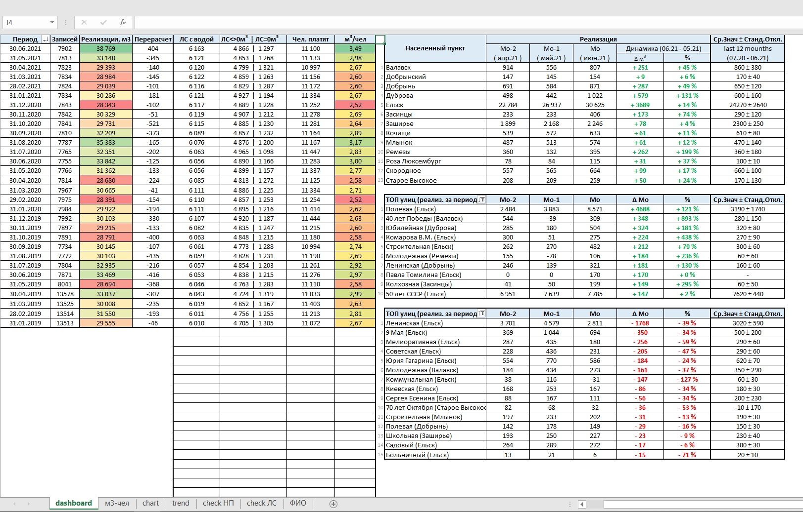

# Анализ реализации воды

Система выполнена на базе Microsoft Excel. Позволяет получать актуальную информацию о состоянии реализации в разрезе населенного пункта, улицы, дома, отображает динамику реализации и упрощает процесс принятия решений по её повышению.

